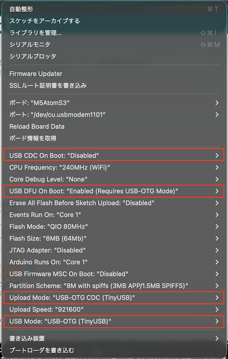

# AtomS3-EnOcean-STM431J

M5AtomS3とSTM431JモジュールでEnOceanデータを受信・表示するArduinoプロジェクト

## 概要

このプロジェクトは、M5AtomS3とEnOcean受信モジュール（USB400J、STM431J）を使用して、EnOcean無線センサーからのデータを受信し、温度とデバイスIDをディスプレイに表示するシステムです。

## 主な機能

- **EnOcean ESP3プロトコル解析**: EnOcean標準プロトコルを完全サポート
- **USB CDC-ACM通信**: USB400Jモジュールとの通信をUSB経由で実現
- **温度センサー対応**: EEP A5-02-05（温度センサー 0-40℃）に対応
- **CRC8検証**: パケットの整合性をCRC8チェックサムで確認
- **リアルタイム表示**: ディスプレイにデバイスIDと温度をリアルタイム表示
- **デバッグ出力**: シリアル経由で詳細なデバッグ情報を出力

## ハードウェア

### 必要な機器

- **M5AtomS3**: メインコントローラー（ESP32-S3搭載）
- **USB400J**: EnOcean受信モジュール（USB接続）
- **STM431J**: EnOcean送信モジュール（温度センサー）
- **MAX3232**: RS-232レベル変換IC（デバッグ用シリアル通信）

### 配線

| ピン | 機能 | 接続先 |
|------|------|--------|
| GPIO5 | UART RX | MAX3232 TX |
| GPIO6 | UART TX | MAX3232 RX |
| USB | USB Host | USB400J |

### 入手方法

必要な機器は以下のサイトから購入できます：

- [[送/受信基板+解説書+CD]電池レス無線マイコンEnOcean IoT開発キット （USB400J / STM431J）- Amazon](https://amzn.to/4sXUijX)

## ソフトウェア要件

### 開発環境

- Arduino IDE 1.8.x 以上 または Arduino IDE 2.x
- ESP32ボードサポート（esp32 by Espressif Systems）

### 必要なライブラリ

1. **M5AtomS3** - M5Stack公式ライブラリ
   ```
   ライブラリマネージャーで「M5AtomS3」を検索してインストール
   ```

2. **esp32-usb-serial** - USB CDC-ACM通信ライブラリ
   ```
   https://github.com/luc-github/esp32-usb-serial
   ```

### 通信設定

- **USB400J通信**: 57600bps, 8N1, USB CDC-ACM
- **デバッグシリアル（Serial2）**: 115200bps, 8N1

## インストール

1. リポジトリをクローン
   ```bash
   git clone https://github.com/yourusername/AtomS3-EnOcean-STM431J.git
   ```

2. Arduino IDEで`AtomS3_STM431J/AtomS3_STM431J.ino`を開く

3. 必要なライブラリをインストール

4. ボード設定
   - ボード: "M5AtomS3"
   - Upload Speed: 115200
   - USB CDC On Boot: "Enabled"

   

5. コンパイル＆書き込み

## 使い方

1. **初期セットアップ**
   - M5AtomS3に電源を投入
   - USB400JをM5AtomS3のUSBポートに接続
   - ディスプレイに「初期化完了」「EnOcean待機中...」と表示されることを確認

2. **データ受信**
   - STM431J（または他のEnOceanセンサー）が送信を開始すると自動的にデータを受信
   - ディスプレイに以下が表示されます：
     - デバイスID（32bit、16進数）
     - 温度（℃、小数点1桁）

3. **操作**
   - **ボタンA押下**: 画面をクリア

4. **デバッグ**
   - Serial2（GPIO5/6）を115200bpsで接続すると詳細なログが確認できます

## EnOcean EEP対応

現在対応しているEnOcean Equipment Profile（EEP）:

| EEP | 説明 | データ範囲 |
|-----|------|-----------|
| A5-02-05 | 温度センサー | 0-40℃ |

## プロトコル仕様

### ESP3パケット構造

```
[0x55][DataLen_H][DataLen_L][OptLen][Type][CRC8H][Data...][OptData...][CRC8D]
```

- **0x55**: 同期バイト
- **DataLen**: データ長（16bit）
- **OptLen**: オプショナルデータ長
- **Type**: パケットタイプ（0x0A = RADIO_ERP1）
- **CRC8H**: ヘッダーCRC
- **Data**: データ部
- **OptData**: オプショナルデータ
- **CRC8D**: データCRC

### CRC8計算

EnOcean標準CRC8多項式: `0x07`

## トラブルシューティング

### USB400Jが認識されない

- USB400JがM5AtomS3のUSBポートに正しく接続されているか確認
- Serial2のデバッグ出力で"USB Connected"が表示されるか確認
- USB CDC On Bootが有効になっているか確認

### データが受信できない

- USB400Jのアンテナ接続を確認
- STM431J（送信側）の電池残量を確認
- Serial2で受信データ（HEX）が出力されているか確認
- 送信側とのEEPプロファイルが一致しているか確認

### CRCエラーが発生する

- Serial2に"Header CRC error"または"Data CRC error"が出力される場合
- USB通信のボーレート設定（57600bps）を確認
- 配線のノイズや接触不良を確認

## ライセンス

MIT License - 詳細は[LICENSE](LICENSE)ファイルを参照してください。

Copyright (c) 2026 Haruhito Fuji

## 参考資料

- [EnOcean Alliance](https://www.enocean-alliance.org/)
- [EnOcean Serial Protocol (ESP3)](https://www.enocean.com/esp)
- [M5AtomS3 Docs](https://docs.m5stack.com/en/core/AtomS3)
- [esp32-usb-serial Library](https://github.com/luc-github/esp32-usb-serial)

## 開発者

Haruhito Fuji

## 更新履歴

- **2026-01-25**: 初版リリース
  - EnOcean ESP3プロトコル対応
  - EEP A5-02-05（温度センサー）実装
  - USB CDC-ACM通信実装
  - CRC8検証機能追加
