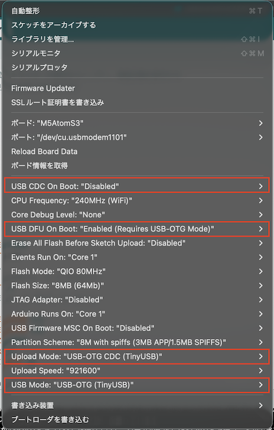

# AtomS3-EnOcean-STM431J

M5AtomS3とSTM431JモジュールでEnOceanデータを受信・表示するArduinoプロジェクト

## 概要

このプロジェクトは、M5AtomS3、EnOcean受信モジュールUSB400J、送信モジュールSTM431Jを使用して、温度とデバイスIDをディスプレイに表示するシステムです。

## 主な機能

- **EnOcean ESP3プロトコル解析**: RADIO_ERP2形式の4BS telegramに対応
- **USB CDC-ACM通信**: USB400Jモジュールとの通信をUSB経由で実現
- **温度センサー対応**: EEP A5-02-05（温度センサー 0-40℃）に対応
- **CRC8検証**: ESP3と内包されたERP2 telegramの整合性をCRC8チェックサムで確認
- **リアルタイム表示**: ディスプレイにデバイスIDと温度をリアルタイム表示
- **デバッグ出力**: シリアル経由で詳細なデバッグ情報を出力

## ハードウェア

### 必要な機器

- **M5AtomS3**: メインコントローラー（ESP32-S3搭載）
- **USB400J**: EnOcean受信モジュール（USB接続）
- **STM431J**: EnOcean送信モジュール（温度センサー）
- **MAX3232**: RS-232レベル変換IC（デバッグ用シリアル通信）

### 配線

| ピン | 機能 | 接続先 |
|------|------|--------|
| GPIO5 | UART RX | MAX3232 TX |
| GPIO6 | UART TX | MAX3232 RX |
| USB | USB Host | USB400J |

### 入手方法

必要な機器は以下のサイトから購入できます：

- [[送/受信基板+解説書+CD]電池レス無線マイコンEnOcean IoT開発キット （USB400J / STM431J）- Amazon](https://amzn.to/4sXUijX)

## ソフトウェア要件

### 開発環境

- Arduino IDE 1.8.x 以上 または Arduino IDE 2.x
- ESP32ボードサポート 3.2.0以上（M5StackまたはEspressif Systems）

### 必要なライブラリ

1. **M5Unified** - M5Stack公式ライブラリ
   ```
   ライブラリマネージャーで「M5Unified」を検索してインストール
   ```

2. **EspUsbHost** - USB CDC-ACM/VCP通信ライブラリ
   ```
   Arduino IDEのライブラリマネージャーで「EspUsbHost」を検索してインストール
   ```

   GitHub: https://github.com/tanakamasayuki/EspUsbHost

### 通信設定

- **USB400J通信**: 57600bps, 8N1, USB CDC-ACM
- **デバッグシリアル（Serial2）**: 115200bps, 8N1

## インストール

1. リポジトリをクローン
   ```bash
   git clone https://github.com/yourusername/AtomS3-EnOcean-STM431J.git
   ```

2. Arduino IDEで`AtomS3_STM431J/AtomS3_STM431J.ino`を開く

3. 必要なライブラリをインストール

4. ボード設定
   - ボード: "M5AtomS3"
   - Upload Speed: 115200
   - USB CDC On Boot: "Enabled"

   

5. コンパイル＆書き込み

## 使い方

1. **初期セットアップ**
   - M5AtomS3に電源を投入
   - USB400JをM5AtomS3のUSBポートに接続
   - ディスプレイに「初期化完了」「EnOcean待機中...」と表示されることを確認

2. **データ受信**
   - STM431J（または他のEnOceanセンサー）が送信を開始すると自動的にデータを受信
   - 通常データ受信時はデバイスID（32bit/48bit、16進数）と温度（℃、小数点1桁）を表示
   - Teach-in受信時はデバイスIDと、その下に`Teach-in`を表示

3. **操作**
   - **ボタンA押下**: 画面をクリア

4. **デバッグ**
   - Serial2（GPIO5/6）を115200bpsで接続すると詳細なログが確認できます
   - `USB chunk`: EspUsbHostから1回に読み出したデータ（パケット途中で分割される場合があります）
   - `ESP3 packet`: 一時バッファで再構築した完全なESP3パケット

## EnOcean EEP対応

現在対応しているEnOcean Equipment Profile（EEP）:

| EEP | 説明 | データ範囲 |
|-----|------|-----------|
| A5-02-05 | 温度センサー | 0-40℃ |

## プロトコル仕様

### ESP3パケット構造

```
[0x55][DataLen_H][DataLen_L][OptLen][Type][CRC8H][Data...][OptData...][CRC8D]
```

- **0x55**: 同期バイト
- **DataLen**: データ長（16bit）
- **OptLen**: オプショナルデータ長
- **Type**: パケットタイプ（0x0A = RADIO_ERP2）
- **CRC8H**: ヘッダーCRC
- **Data**: データ部
- **OptData**: オプショナルデータ
- **CRC8D**: データCRC

### RADIO_ERP2 / A5-02-05解析

ESP3の`Data`には、先頭のLENGTHを除いたERP2 telegramが格納されます。
このプロジェクトではERP2ヘッダーのAddress ControlからOriginator ID長を決定し、
32bit ID（ヘッダー`0x22`）と48bit ID（ヘッダー`0x62`）の両方を処理します。

```
[ERP2 Header][Originator ID][DB3][DB2][DB1][DB0][ERP2 CRC]
```

実機で取得したSTM431Jの例:

```text
# Teach-in telegram（48bit ID=0x00000400CB76、液晶にTeach-inとIDを表示）
55 00 0C 02 0A E6 62 00 00 04 00 CB 76 08 28 0B 80 89 01 2B C4

# 通常データtelegram（32bit ID、ID=0x0400CB76）
55 00 0A 02 0A 9B 22 04 00 CB 76 00 00 55 08 BD 01 29 CA
```

4BSの`DB0`にあるLearn bitが0の場合はTeach-in telegramとして判定し、
液晶にOriginator IDと、その下に`Teach-in`を表示します。

```text
EnOcean受信:

ID: 00000400CB76

Teach-in
```

通常データでは`DB1`をA5-02-05の温度値として、次式で0〜40℃に変換します。

```text
温度[℃] = 40 - (DB1 × 40 / 255)
```

上記の通常データでは`DB1 = 0x55`なので、温度は約26.67℃です。

### CRC8計算

EnOcean標準CRC8多項式: `0x07`

- ESP3ヘッダーCRC: `DataLen_H`から`Type`までを検証
- ESP3データCRC: `Data`と`OptData`を検証
- ERP2 CRC: ERP2の`Header`からCRC直前までを検証（`Length`自身は対象外）

ESP3データCRCが正常でも、内包されたERP2 CRCが不正な場合は温度やTeach-in状態を表示せず、
`Invalid ERP2 CRC`をデバッグログへ出力してパケットを破棄します。

### USBシリアル受信処理

USBシリアルの読み出し境界はESP3パケット境界と一致するとは限りません。このため、
EspUsbHostから読み出したデータを1024バイトの一時バッファへ蓄積し、次の手順で処理します。

1. 同期バイト`0x55`を検索
2. 6バイトのESP3ヘッダーとヘッダーCRCを確認
3. `7 + DataLen + OptLen`からパケット全体の長さを算出
4. 完全なパケットが揃うまで次の受信データを待機
5. ESP3データCRCを確認
6. RADIO_ERP2の場合は内包されたERP2 CRCを確認してからパケットを解析
7. バッファに後続パケットがあれば続けて解析

これにより、1パケットが複数回に分割された場合、複数パケットを一度に受信した場合、
および受信データの同期がずれた場合に対応します。CRCエラー時は次の同期バイトを探索し、
USB切断時には受信途中のデータを破棄します。

デバッグログではUSBの読み出し単位を`USB chunk`、再構築後の完全なパケットを
`ESP3 packet`として区別して表示します。分割受信時は複数の`USB chunk`の後に、
それらを結合した1件の`ESP3 packet`が表示されます。

## トラブルシューティング

### USB400Jが認識されない

- USB400JがM5AtomS3のUSBポートに正しく接続されているか確認
- Serial2のデバッグ出力で"USB Serial Connected"が表示されるか確認
- EspUsbHostがインストールされ、ESP32ボードサポートが3.2.0以上であることを確認
- USB CDC On Bootが有効になっているか確認

### データが受信できない

- USB400Jのアンテナ接続を確認
- STM431J（送信側）の電池残量を確認
- Serial2で受信データ（HEX）が出力されているか確認
- 送信側とのEEPプロファイルが一致しているか確認

### CRCエラーが発生する

- Serial2に"Header CRC error"または"Data CRC error"が出力される場合
- USB通信のボーレート設定（57600bps）を確認
- 配線のノイズや接触不良を確認

## ライセンス

MIT License - 詳細は[LICENSE](LICENSE)ファイルを参照してください。

Copyright (c) 2026 Haruhito Fuji

## 参考資料

- [EnOcean Alliance](https://www.enocean-alliance.org/)
- [EnOcean Serial Protocol (ESP3)](https://www.enocean.com/esp)
- [M5AtomS3 Docs](https://docs.m5stack.com/en/core/AtomS3)
- [EspUsbHost Library](https://github.com/tanakamasayuki/EspUsbHost)

## 開発者

Haruhito Fuji

## 更新履歴

- **2026-08-17**: USB HostライブラリをEspUsbHostへ変更
  - EspUsbHostCdcSerialによるUSB CDC-ACM/VCP通信へ移行
  - 独自のUSB接続タスクとセマフォを削除
  - M5AtomS3ラッパーをM5Unifiedの直接利用へ変更
  - USB受信データを1024バイト蓄積し、完全なESP3パケット単位で解析
  - CRCエラー時の再同期とUSB切断時の受信バッファ破棄に対応
  - RADIO_ERP2の32bit/48bit Originator IDとTeach-in判定に対応
  - EEP A5-02-05の温度変換式を修正
  - USB読み出し単位と再構築済みESP3パケットのログを分離
  - Teach-in受信時の液晶表示を追加
  - 内包されたERP2 CRCを検証し、不正なradio telegramを破棄
- **2026-01-25**: 初版リリース
  - EnOcean ESP3プロトコル対応
  - EEP A5-02-05（温度センサー）実装
  - USB CDC-ACM通信実装
  - CRC8検証機能追加
